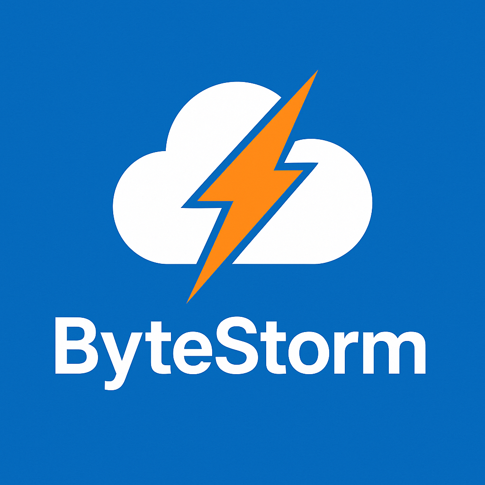

<div style="display: flex; align-items: flex-start; gap: 20px;">

  

  <div>
    <h1>🌩️ ByteStorm – Das modulare Minecraft Cloud-System</h1>
    <p><strong>ByteStorm</strong> ist ein modulares, hochperformantes Cloud-System für Minecraft-Servernetzwerke.<br>
    Es wurde von Grund auf in Java entwickelt, um Skalierbarkeit, Erweiterbarkeit und Wartbarkeit sicherzustellen.<br>
    Es folgt dem Prinzip: <strong>"Ein Modul, eine Aufgabe – maximaler Impact!"</strong> 🧠💻<br>
    Das coole an dem Projekt? Es ist <strong>komplett Open Source</strong>! Jeder kann mitmachen und das System erweitern.<br>
    Jede/r ist herzlich eingeladen, sich an der Entwicklung zu beteiligen und das System nach den eigenen Bedürfnissen anzupassen.<br>
    Um dich einzubringen, schau dir die <a href="CONTRIBUTING.md">Contributing Guidelines</a> an.</p>
  </div>

</div>

---

## 📖 Inhaltsverzeichnis
- [📖 Inhaltsverzeichnis](#-inhaltsverzeichnis)
- [📦 Modulübersicht](#-modulübersicht)
  - [common/](#common---utilities--shared-logic)
  - [core/](#core---zentrale-steuerungseinheit)
  - [api/](#api---öffentliche-programmierschnittstelle)
  - [bridge/common/](#bridgecommon---common-modul-für-alle-bridge-module)
  - [bridge/velocity/](#bridgevelocity---proxy-anbindung-velocitybungee)
  - [bridge/legacy/](#bridgelegacy---legacy-proxy-anbindung-bungeecord)
  - [bridge/spigot/](#bridgespigot---spigot-anbindung)
  - [bridge/paper/](#bridgepaper---paper-anbindung)
  - [bridge/purpur/](#bridgepurpur---purpur-anbindung)
  - [bridge/folia/](#bridgefolia---folia-anbindung)
  - [bridge/minestom/](#bridgeminestom---minestom-anbindung)
  - [controller/](#controller---cli--web-controller)
  - [agent/](#agent---agent-auf-zielservern)
  - [dashboard/](#dashboard---web-dashboard-optional)
- [🔧 Technischer Überblick](#-technischer-überblick)
- [📁 Modulstruktur](#-modulstruktur)
- [🚀 Zielgruppe](#-zielgruppe)
- [✨ Noch in Planung](#-noch-in-planung)
- [📖 Lizenz](#-lizenz)
- [📞 Kontakt](#-kontakt)

---

## 📦 Modulübersicht

Hier findest du eine Übersicht über alle Module und ihre jeweilige Verantwortung im ByteStorm-Ökosystem:

---

### `common/` – 🔧 Utilities & Shared Logic
> Dieses Modul enthält allgemeine Klassen und Tools, die von allen anderen Modulen gemeinsam genutzt werden:
- Konfigurations-Handling
- Logging-System
- Utility-Klassen (z. B. für Dateien, Zeit, Threads)
- Gemeinsame Interfaces & Enums

---

### `core/` – 💥 Zentrale Steuerungseinheit
> Das Herzstück von ByteStorm – führt die Serverlogik aus:
- Startet und verwaltet interne Dienste
- Lifecycle-Management (Start, Stop, Reload)
- Eventsystem & Command-Handling
- Koordination aller Subsysteme

---

### `api/` – 🧩 Öffentliche Programmierschnittstelle
> Externe Plugins oder Tools können dieses Modul nutzen, um mit ByteStorm zu interagieren:
- Servergruppen und Templates
- Spielerinformationen
- Schnittstellen für Drittentwickler
- Status- und Query-APIs

---

### `bridge/common/` – 💼 Common Modul für alle Bridge-Module
> Enthält gemeinsame Logik für alle Bridge-Module:
- Gemeinsame Schnittstellen und Klassen
- Utility-Funktionen für die Kommunikation
- Event-Handling für alle Minecraft-Server-Instanzen
- Synchronisations-Tools
- Konfigurationsmanagement für Bridge-Module

### `bridge/velocity/` – 🌉 Proxy-Anbindung (Velocity/Bungee)
> Sorgt für die Kommunikation zwischen ByteStorm und Minecraft Instanzen:
- Leitet Spieler-Events weiter
- Synchronisiert Daten über Proxies
- Ermöglicht zentrale Steuerung via Proxy

### `bridge/legacy/` – 🕰️ Legacy Proxy-Anbindung (BungeeCord)
> Für ältere BungeeCord-Installationen, die noch nicht auf Velocity umgestiegen sind:
- Bietet ähnliche Funktionalität wie `bridge/proxy/`
- Kompatibilität zu bestehenden BungeeCord-Setups
- Ermöglicht Migration zu Velocity in Zukunft

### `/bridge/spigot/` – 🧩 Spigot-Anbindung
> Bindet ByteStorm direkt an Spigot-Server an:
- Ermöglicht direkte Kommunikation mit Spigot-Plugins
- Sorgt für nahtlose Integration in Spigot-Ökosysteme
- Ermöglicht serverseitige Steuerung und Abfragen
- Erweiterbar für zukünftige Spigot-Versionen

### `bridge/paper/` – 🧩 Paper-Anbindung
> Bindet ByteStorm direkt an Paper-Server an:
- Tut das gleiche wie `bridge/spigot/`, aber optimiert für Paper-Server Features
- Nutzen von Paper-spezifischen APIs
- Erweiterbar für zukünftige Paper-Versionen

### `bridge/purpur/` – 🧩 Purpur-Anbindung
> Bindet ByteStorm direkt an Purpur-Server an:
- Tut das gleiche wie `bridge/paper/`, aber optimiert für Purpur-Server Features
- Nutzen von Purpur-spezifischen APIs
- Erweiterbar für zukünftige Purpur-Versionen

### `bridge/folia/` – 🧩 Folia-Anbindung
> Bindet ByteStorm direkt an Folia-Server an:
- Tut das gleiche wie `bridge/paper/`, aber optimiert für Folia-Server Features
- Nutzen von Folia-spezifischen APIs
- Erweiterbar für zukünftige Folia-Versionen

### `bridge/minestom/` – 🚀 Minestom-Anbindung
> Bindet ByteStorm direkt an Minestom-Server an:
- Tut das gleiche wie `bridge/paper/`, aber optimiert für Minestom-Server Features
- Nutzen von Minestom-spezifischen APIs
- Erweiterbar für zukünftige Minestom-Versionen

---

### `controller/` – 🖥️ CLI & Web-Controller
> Steuere ByteStorm bequem über eine Kommandozeile oder Web-UI:
- CLI-Eingaben & Parsing
- Webserver mit REST-API
- Authentifizierung & Rechtekontrolle
- Verwaltung von Servergruppen und Templates
- Echtzeit-Statusabfragen
- Webhooks für externe Integrationen


---

### `agent/` – 🤖 Agent auf Zielservern
> Läuft direkt auf Minecraft-Servern zur Fernsteuerung:
- Startet/Stoppt Minecraft-Instanzen
- Sendet Statusdaten an Core zurück
- Updater & Heartbeat-System

---

### `dashboard/` – 📊 Web-Dashboard (optional)
> Schönes, modernes UI zur Verwaltung deiner Serverstruktur:
- Zeigt Spieler- & Serverstatus
- Start/Stop von Servern per Web
- Verwaltung von Templates & Gruppen
- Benutzerverwaltung mit Tokens

---

## 🔧 Technischer Überblick

- **Sprache:** Java 21
- **Buildsystem:** Gradle (Groovy DSL, Multi-Module)
- **Designprinzipien:** OOP, Single Responsibility, Dependency Injection, Modularität
- **Ziel:** Performantes, erweiterbares Minecraft Cloud-System mit professionellem Unterbau

---

## 📁 Modulstruktur

```plaintext
ByteStorm/
├── common/ → Geteilter Code
├── core/ → Zentrale Steuerung
├── api/ → Öffentliche API
├── bridge/ → Verbindung zu Proxies
│   ├── common/ → Gemeinsame Logik für alle Bridge-Module
│   ├── velocity/ → Velocity Proxy
│   ├── legacy/ → BungeeCord Proxy
│   ├── spigot/ → Spigot-Anbindung
│   ├── paper/ → Paper-Anbindung
│   ├── purpur/ → Purpur-Anbindung
│   ├── folia/ → Folia-Anbindung
│   └── minestom/ → Minestom-Anbindung
├── controller/ → CLI & Webserver
├── agent/ → Remote Agent
├── dashboard/ → Optionales Admin-Interface
└── README.md → Dokumentation
```

---

## 🚀 Zielgruppe

- Entwickler von Minecraft-Servernetzwerken
- Plugin-Entwickler, die serverseitige Kontrolle brauchen
- Serveradministratoren, die ein leicht steuerbares, aber mächtiges System wollen

---

## ✨ Noch in Planung

- Datenbankmodule (Redis/MySQL)
- Plugin-Marktplatz
- Erweiterungs-API
- Discord-Bot für Steuerung per Chat

---

## 📖 Lizenz
ByteStorm ist unter der [MIT-Lizenz](LICENSE) lizenziert.

---

## 📞 Kontakt
> Hast du Fragen, Ideen oder möchtest du einfach nur mitmachen?
> Schau in unseren [Discord](https://discord.gg/your-discord-link) oder öffne ein Issue auf GitHub!

---

> Bereit, dein Netzwerk auf ein neues Level zu bringen? Willkommen bei **ByteStorm**! 🫡⚔️
